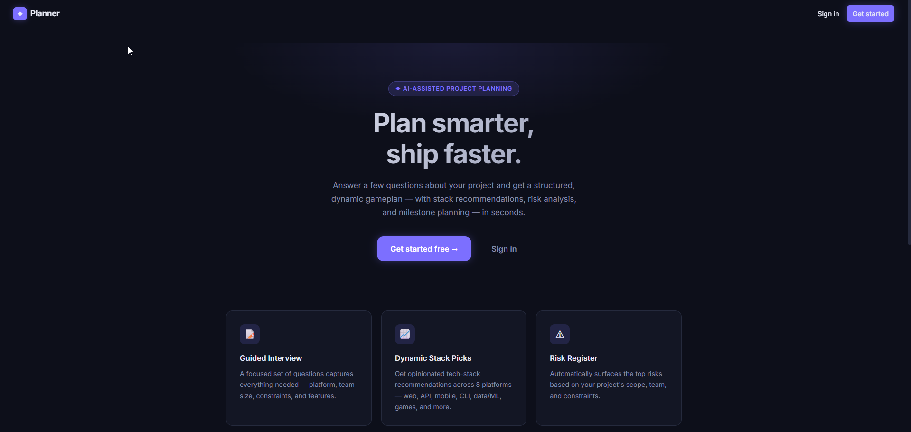
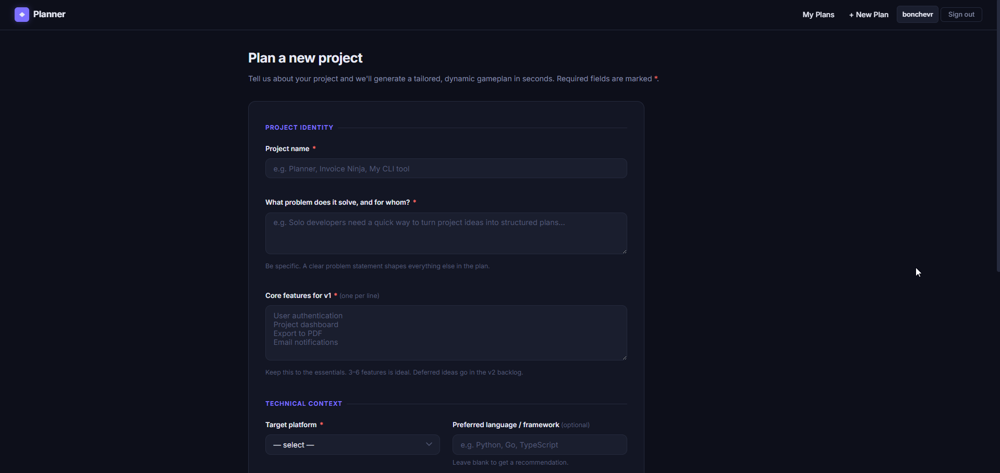
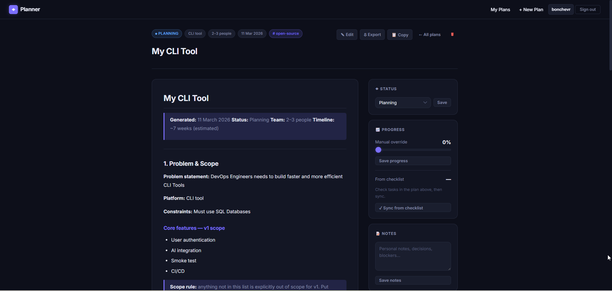
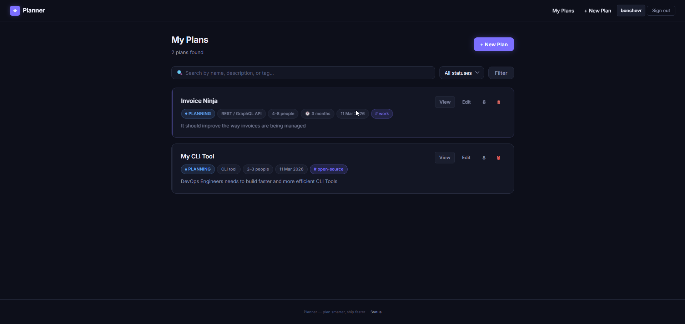

# Planner Agent

[](https://github.com/bonchevr/planner_agent_project/actions/workflows/fly-deploy.yml)

A lightweight Python web app that guides you through a structured project interview and generates a ready-to-use **Project Gameplan** as a Markdown document — in under 5 minutes.

Key features:
- **Structured interview** — guided form captures goals, constraints, tech preferences, and timeline
- **AI-free generation** — rule-based `GameplanGenerator` + context-aware `StackRecommender` produce a tailored tech stack, architecture notes, and milestone list
- **Interactive progress tracking** — sidebar checklist syncs with embedded Markdown task items
- **Shareable read-only links** — generate a public UUID slug per gameplan without exposing other plans
- **Password reset via email** — signed 1-hour tokens delivered through Resend SMTP
- **Full auth** — per-user accounts with bcrypt passwords, CSRF protection, and signed session cookies

**Live demo:** <https://planner-agent.fly.dev/>

---

## Requirements

| Tool | Minimum version | Notes |
|------|----------------|-------|
| Python | 3.11+ | Only needed for the local dev workflow |
| Docker Desktop | 4.x+ | Required for the Docker / Compose workflow |
| Make | any | Ships with macOS/Linux; Windows: use Git Bash or WSL |

---

## Option A — Docker Desktop (recommended)

This is the fastest way to get running on any machine.

```bash
# 1. Clone the repo
git clone https://github.com/bonchevr/planner_agent_project.git
cd planner_agent_project

# 2. (Optional) create a .env file from the example
cp .env.example .env
# Edit .env if you want to override any defaults

# 3. Build the image and start the container
make compose-up
# → http://localhost:8000

# Stop the container when done
make compose-down
```

The database is persisted in the `postgres-data` Docker volume. Your data survives container restarts.

---

## Option B — Local Python (development / hot-reload)

Use this when you want live code reloading while working on the app.

```bash
# 1. Clone the repo
git clone https://github.com/bonchevr/planner_agent_project.git
cd planner_agent_project

# 2. Create and activate a virtual environment
python3 -m venv .venv
source .venv/bin/activate        # Windows: .venv\Scripts\activate

# 3. Install runtime + dev dependencies
pip install -r requirements.txt -r requirements-dev.txt

# 4. Copy and review environment config
cp .env.example .env

# 5. Start the dev server with auto-reload
make dev
# → http://localhost:8000
```

---

## URLs

### Production

| URL | Description |
|-----|-------------|
| https://planner-agent.fly.dev/ | Home page (live) |
| https://planner-agent.fly.dev/interview | Start a new project interview |
| https://planner-agent.fly.dev/health | Health check (JSON) |

### Local development

| URL | Description |
|-----|-------------|
| http://localhost:8000 | Home page |
| http://localhost:8000/interview | Start a new project interview |
| http://localhost:8000/health | Health check (JSON) |
| http://localhost:8000/metrics | Prometheus metrics scrape endpoint |
| http://localhost:8000/docs | Interactive API docs (Swagger UI) |

---

## Running tests

```bash
# Activate your virtual environment first (Option B only)
make test
# Runs pytest with coverage — target ≥ 80%
```

---

## Make targets

| Command | Description |
|---------|-------------|
| `make dev` | Start Uvicorn with auto-reload (local) |
| `make test` | Run pytest with coverage report |
| `make lint` | Lint with ruff |
| `make format` | Auto-format with ruff |
| `make compose-up` | Build image + start container via Docker Compose |
| `make compose-down` | Stop and remove the container |
| `make docker-build` | Build Docker image only |
| `make docker-run` | Run container directly (no Compose) |

---

## Environment Variables

Copy `.env.example` to `.env` before running. All variables have safe defaults for local development.

| Variable | Default | Description |
|----------|---------|-------------|
| `APP_ENV` | `development` | Set to `production` when deploying |
| `DATABASE_URL` | `sqlite:///./data/planner.db` | SQLite (local dev) or PostgreSQL URL |
| `SECRET_KEY` | `change-me-before-deploying` | **Change this before any public deployment** |
| `BASE_URL` | `http://localhost:8000` | Public base URL (used for password-reset links) |
| `WEB_WORKERS` | `2` | Number of Uvicorn workers (production uses 2) |
| `SMTP_HOST` | _(unset)_ | SMTP server hostname (e.g. `smtp.resend.com`) |
| `SMTP_PORT` | `587` | `465` for SSL (Resend), `587` for STARTTLS |
| `SMTP_USER` | _(unset)_ | SMTP username (e.g. `resend`) |
| `SMTP_PASSWORD` | _(unset)_ | SMTP credential / API key |
| `SMTP_FROM` | _(unset)_ | Sender address shown in email (e.g. `Planner Agent <noreply@yourdomain.com>`) |

---

## Project Structure

```
app/
  main.py              FastAPI app factory + router registration
  config.py            Settings loaded from environment / .env
  db.py                SQLAlchemy engine + session factory (pool_pre_ping enabled)
  email.py             Password-reset email delivery (SMTP, SSL/STARTTLS)
  generator.py         GameplanGenerator + StackRecommender + render_md
  logging_config.py    loguru structured logging (JSON in production)
  models/              Pydantic + SQLModel data models
  routes/
    planner.py         /interview, /generate, /gameplan/{id}, /share/{slug}
    auth.py            /register, /login, /logout, /forgot-password, /reset-password
    health.py          GET /health, GET /metrics
  templates/           Jinja2 HTML templates (base, index, interview, gameplan,
                       gameplans, login, register, forgot_password, reset_password,
                       shared_gameplan)
  static/              CSS and static assets
tests/                 pytest test suite (≥ 80% coverage)
docs/
  planner-agent.md     Project roadmap and phase status
  planner-agent-production.md  Deployment runbook
  *.png                Application screenshots
Dockerfile             Production container image
docker-compose.yml     Local Docker Desktop workflow
Makefile               Developer shortcuts
entrypoint.sh          Container startup: wait-for-DB → Alembic → Uvicorn
fly.toml               Fly.io deployment configuration
```

---

## Deployment

The app is deployed on [Fly.io](https://fly.io) using a Docker container backed by [Neon](https://neon.tech) serverless PostgreSQL. Deployment is fully automated via GitHub Actions — every push to `main` that passes CI is deployed automatically.

See [docs/planner-agent-production.md](docs/planner-agent-production.md) for the full deployment runbook.

The CI/CD pipeline (`.github/workflows/fly-deploy.yml`) runs three parallel jobs on every push to `main`:
1. **Lint & Test** — ruff + pytest
2. **Push image → Docker Hub** — `bonchevr/planner-agent:latest` + `bonchevr/planner-agent:sha-<commit>` (requires `DOCKERHUB_TOKEN` Actions secret)
3. **Deploy → Fly.io** — `flyctl deploy --remote-only` (requires `FLY_API_TOKEN` Actions secret)

---

## Roadmap

See [docs/planner-agent.md](docs/planner-agent.md) for the full project roadmap and phase status.

---

## Screenshots

### Home page


### Interview form


### Generated gameplan


### My Plans list

